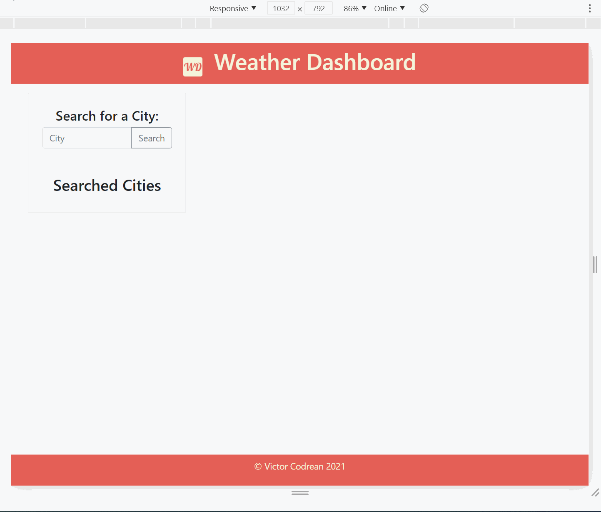

# Weather_Dashboard [Deployed product](https://victorcodrean.github.io/API_Weather_Dashboard/)
A weather dashboard that retrieves data from OpenWeather API
# Table of Contents
- [Description](#Description)
- [Instructions](#Instructions)
- [Illustration](#Illustration)
- [Framework HTML/CSS/JS](#Framework)
- [Quick GoThrough](#Gothrough)
- [Credits](#Credits)

## Description
This site provides access current weather data and (5 day)-Forecast for any location on Earth including over 200,000 cities! The data is frequently updated based on global and local weather models, satellites, radars and vast network of weather stations.
## Instructions
* Search City:
  * Input a city name
  * Click Search button
  * Inserted city will be searched and retrieve weather data
## Framework
* HTML- Data & CSS - (build with Bootstrap and own CSS style)
* JS - code:
    * Jquerry$ and WEB API (Transversing the DOM...)
        ```
        .querySelector
        .setAttribute
        .append()
        $(document).on("click")
        $("#").addClass()
        ...
        ```
    * Server WEB Api's
        * Main call for api data
         ```
        fetch(requestUrl)
        .then(function (response) {
            return response.json();
        })
        .then(function (data) {
            ...
        }
        ...
        ```
    * for loops:
        ```
        ...
        for (var i = 0; i < data.list.length; i++) {
            $("<section>").addClass().text()
            .append(.clone())          
        }
        ```
    * if/else statements:
    * localStorage to store any persistent data:
        ```
        ...
        localStorage.setItem("searchedCities", JSON.stringify(searchedCities));
        ```

## Gothrough
* When search button is clicked 
* fetch data call is activated to get weatherdata from OpenWeather API
* You're presented with current and future conditions for that city and that city is added to the search history
* The searched city data contains the city name, the date, an icon representation of weather conditions,    the temperature, the humidity, the wind speed, and the UV index.
* The UV index is represented with a color that indicates if conditions are favorable, moderate, high, severe, extreme
* For future conditions you get 5-day Forecast which displays: the date, an icon, the temperature and the humidity
* Aside container on left hand contains history of searched cities so you can access current and future conditions for saved city 

## Illustration


## Credits
* List of the resources used to complete this project:
    * - [OpenWeather](https://openweathermap.org/api)
    * - [Bootstrap](https://bulma.io/documentation/overview/start/)
    * - [StackOverFlow](https://stackoverflow.com/)
    * - [W3Schools](https://www.w3schools.com/) 

## APIs
* - [CurrentWeather](https://openweathermap.org/current)
* - [5DayForecast](https://openweathermap.org/forecast5)

## Contributing
* Victor Codrean
  * [Email: CodreanVictor](CodreanVictor@gmail.com)
  * [GitHub: Victor Codrean](https://github.com/VictorCodrean)

## Directory
* [Deployed Website](https://victorcodrean.github.io/API_Weather_Dashboard/)
* [GitHub Source](https://github.com/VictorCodrean/API_Weather_Dashboard)
